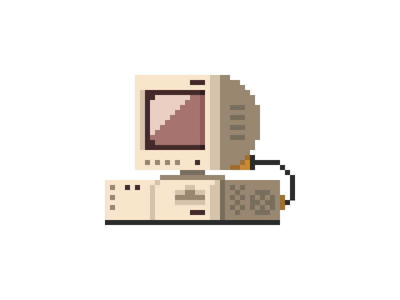

# Olá, Sou Viviane. 


Sou uma desenvolvedora Back-End em <b>transição de carreira</b>, vindo da área de informática para o desenvolvimento de software. 

Formada em **Análise e Desenvolvimento de sistemas** e atualmente curso **Ciência da Computação** na [UNINTER](https://www.uninter.com).

---


### Minha jornada de código na última semana

<!--START_SECTION:waka-->

```txt
sh           1 hr 28 mins          ████████████▓░░░░░░░░░░░░   50.00 %
PHP          31 mins               ████▓░░░░░░░░░░░░░░░░░░░░   18.06 %
JavaScript   30 mins               ████▒░░░░░░░░░░░░░░░░░░░░   17.26 %
HTML         16 mins               ██▒░░░░░░░░░░░░░░░░░░░░░░   09.22 %
CSS          9 mins                █▒░░░░░░░░░░░░░░░░░░░░░░░   05.36 %
```

<!--END_SECTION:waka-->
