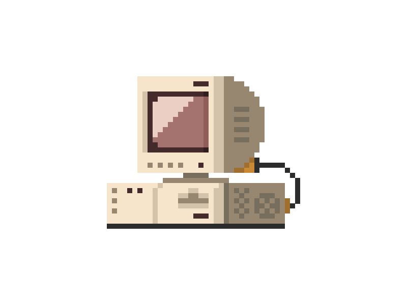

# Olá, Sou Vivi. 


Sou uma desenvolvedora Back-End em <b>transição de carreira</b>, vindo da área de informática para o desenvolvimento de software. 

Formada em **Análise e Desenvolvimento de sistemas**.

---


### Minha jornada de código na última semana

<!--START_SECTION:waka-->

```txt
Python     1 hr 55 mins          █████████████▒░░░░░░░░░░░   53.88 %
Markdown   1 hr 36 mins          ███████████▒░░░░░░░░░░░░░   44.95 %
Text       1 min                 ▒░░░░░░░░░░░░░░░░░░░░░░░░   00.87 %
Other      0 secs                ░░░░░░░░░░░░░░░░░░░░░░░░░   00.30 %
```

<!--END_SECTION:waka-->
