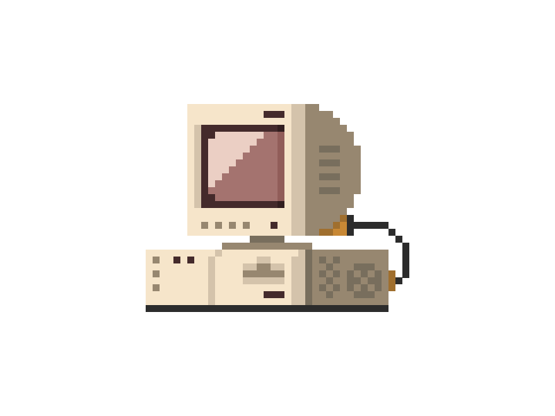

# Olá, Sou Vivi. 


Sou uma desenvolvedora Back-End em <b>transição de carreira</b>, vindo da área de informática para o desenvolvimento de software. 

Formada em **Análise e Desenvolvimento de sistemas**.

---


### Minha jornada de código na última semana

<!--START_SECTION:waka-->

```txt
Python   1 hr 12 mins          █████████████░░░░░░░░░░░░   52.02 %
HTML     1 hr 7 mins           ████████████░░░░░░░░░░░░░   47.98 %
```

<!--END_SECTION:waka-->
